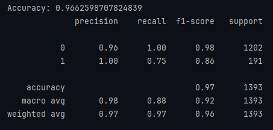
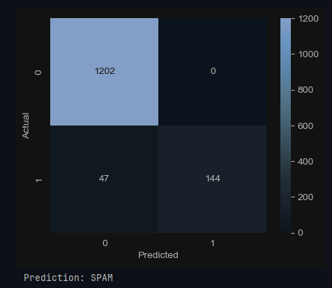

<!DOCTYPE html>
<html>
<head>
    <meta charset="UTF-8">

</head>
<body>

<h1>Email Spam Detection using Machine Learning</h1>

This project implements an <b>Email Spam Detection system</b> using Machine Learning and
Natural Language Processing (NLP). The goal is to classify emails as
<b>Spam</b> or <b>Not Spam</b> based on their textual content.

<h2>Project Overview</h2>

Email spam is a common problem in digital communication. This project uses machine learning
to automatically detect spam emails by learning patterns from labeled message data.

<h2>How It Works</h2>

<ul>
    <li>Load and clean the email dataset</li>
    <li>Convert text data into numerical features using TF-IDF</li>
    <li>Split data into training and testing sets</li>
    <li>Train a Multinomial Naive Bayes classifier</li>
    <li>Evaluate performance using accuracy and classification metrics</li>
</ul>

<h2>Project Files & Tools</h2>

<table border="1" cellpadding="6" cellspacing="0">
    <tr>
        <th>Item</th>
        <th>Description</th>
    </tr>
    <tr>
        <td>spam.csv</td>
        <td>Dataset containing labeled email messages (spam / ham)</td>
    </tr>
    <tr>
        <td>SpamDetection.ipynb</td>
        <td>Jupyter Notebook with preprocessing, model training, and evaluation</td>
    </tr>
    <tr>
        <td>Accuracy.png</td>
        <td>Image showing model accuracy</td>
    </tr>
    <tr>
        <td>Prediction.png</td>
        <td>Sample spam / non-spam prediction output</td>
    </tr>
    <tr>
        <td>Tools Used</td>
        <td>Python, Pandas, NumPy, Scikit-learn</td>
    </tr>
    <tr>
        <td>NLP Technique</td>
        <td>TF-IDF Vectorization</td>
    </tr>
    <tr>
        <td>Model</td>
        <td>Multinomial Naive Bayes</td>
    </tr>
</table>

<h2>Model Results</h2>

<h3>Accuracy</h3>

<h3>Sample Prediction</h3>

<h2>Advantages</h2>

<ul>
    <li>Automatically detects spam emails</li>
    <li>Reduces manual email filtering</li>
    <li>Fast and efficient for large text datasets</li>
    <li>Applicable to real-world email systems</li>
</ul>

<h2>Conclusion</h2>

This project demonstrates the practical use of NLP and Machine Learning for text classification.
By combining TF-IDF feature extraction with Naive Bayes, the system effectively identifies
spam emails and can be extended for real-world email security applications.

</body>
</html>
