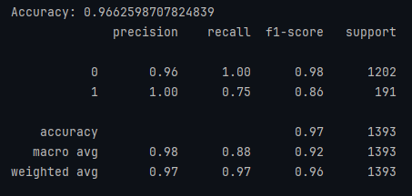
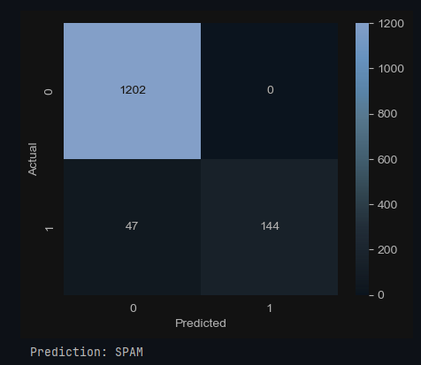

<!DOCTYPE html>
<html>
<head>
    <meta charset="UTF-8">
    
</head>
<body>

<h1>📧 Email Spam Detection using Machine Learning</h1>

<p>
This project implements an <b>Email Spam Detection System</b> using Machine Learning and
Natural Language Processing (NLP). The objective is to automatically classify emails as
<b>Spam</b> or <b>Not Spam (Ham)</b> based on their textual content.
</p>

<hr>

<h2>📌 Project Overview</h2>

<p>
Email spam is one of the most common cybersecurity and communication challenges.
This project applies Machine Learning techniques to analyze email content and identify
whether a message is spam or legitimate. The model learns patterns from historical
labeled emails and predicts the category of new incoming messages.
</p>

<hr>

<h2>⚙️ How It Works</h2>

<ul>
    <li>Load and preprocess the email dataset</li>
    <li>Clean and transform text data</li>
    <li>Convert text into numerical features using TF-IDF Vectorization</li>
    <li>Split dataset into training and testing sets</li>
    <li>Train the Multinomial Naive Bayes model</li>
    <li>Evaluate model performance using accuracy and classification metrics</li>
    <li>Predict whether new emails are spam or not spam</li>
</ul>

<hr>

<h2>🛠️ Technologies Used</h2>

<ul>
    <li>Python</li>
    <li>Pandas</li>
    <li>NumPy</li>
    <li>Scikit-Learn</li>
    <li>Natural Language Processing (NLP)</li>
    <li>TF-IDF Vectorization</li>
    <li>Jupyter Notebook</li>
</ul>

<hr>

<h2>📂 Project Structure</h2>

<pre>
Email-Spam-Detection/
│
├── notebook/
│   └── SpamDetection.ipynb
│
├── screenshot/
│   ├── Accuracy.png
│   └── Prediction.png
│
├── spam.csv
└── README.md
</pre>

<hr>

<h2>📁 Folder Description</h2>

<table border="1" cellpadding="8" cellspacing="0">
<tr>
<th>Folder/File</th>
<th>Description</th>
</tr>

<tr>
<td>notebook/</td>
<td>Contains Jupyter Notebook with complete data preprocessing, feature extraction, model training and evaluation.</td>
</tr>

<tr>
<td>screenshot/</td>
<td>Contains project output screenshots including accuracy and prediction results.</td>
</tr>

<tr>
<td>spam.csv</td>
<td>Dataset containing spam and ham email messages used for model training.</td>
</tr>

<tr>
<td>README.md</td>
<td>Project documentation, workflow explanation and results.</td>
</tr>

</table>

<hr>

<h2>📊 Project Files & Tools</h2>

<table border="1" cellpadding="8" cellspacing="0">

<tr>
<th>Item</th>
<th>Description</th>
</tr>

<tr>
<td>spam.csv</td>
<td>Dataset containing labeled email messages (Spam/Ham)</td>
</tr>

<tr>
<td>SpamDetection.ipynb</td>
<td>Jupyter Notebook containing preprocessing, model training and evaluation</td>
</tr>

<tr>
<td>Accuracy.png</td>
<td>Model performance and accuracy output screenshot</td>
</tr>

<tr>
<td>Prediction.png</td>
<td>Sample prediction result screenshot</td>
</tr>

<tr>
<td>Machine Learning Model</td>
<td>Multinomial Naive Bayes</td>
</tr>

<tr>
<td>Feature Extraction</td>
<td>TF-IDF Vectorization</td>
</tr>

<tr>
<td>Programming Language</td>
<td>Python</td>
</tr>

</table>

<hr>

<h2>📸 Project Screenshots</h2>

<h3>🎯 Model Accuracy</h3>



<br><br>

<h3>📩 Spam Detection Prediction</h3>



<hr>

<h2>📈 Model Results</h2>

<ul>
    <li>Successfully classified emails into Spam and Ham categories.</li>
    <li>High prediction accuracy using TF-IDF and Naive Bayes.</li>
    <li>Fast and efficient text classification performance.</li>
    <li>Suitable for real-world email filtering applications.</li>
</ul>

<hr>

<h2>✅ Advantages</h2>

<ul>
    <li>Automatically detects spam emails</li>
    <li>Reduces manual email filtering effort</li>
    <li>Fast and scalable solution</li>
    <li>Improves email security and user productivity</li>
    <li>Can be extended for real-time spam filtering systems</li>
</ul>

<hr>

<h2>🎯 Conclusion</h2>

<p>
This project demonstrates the practical application of Machine Learning and Natural Language
Processing for text classification. By combining TF-IDF feature extraction with the
Multinomial Naive Bayes algorithm, the system effectively identifies spam emails and
provides a foundation for building advanced email security solutions.
</p>

</body>
</html>
```
